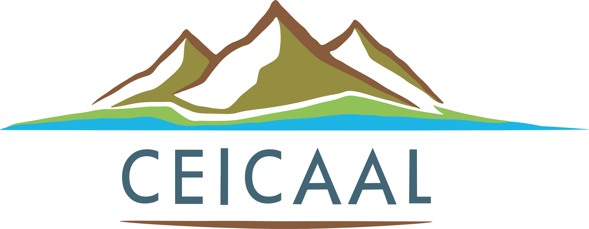

# Interactive Map Project - Provincia de Jujuy

## 🔐 Nota sobre el Repositorio

Este repositorio público contiene únicamente la documentación del proyecto. **El código fuente y datos completos se encuentran en un repositorio privado** debido a la sensibilidad de la información geoespacial manejada. Para acceder al repositorio completo o más información:

📧 Contactar al autor: mirtybmx@gmail.com

## 📌 Descripción

Aplicación web interactiva que visualiza información geoespacial de la provincia de Jujuy, Argentina, con enfoque en limnología. El proyecto permite analizar:

- Cuencas y microcuencas hidrográficas
- Red de cursos de agua
- Distribución de ecorregiones
- Composición textural de suelos

## 🏛️ Contexto Institucional

Este proyecto se desarrolla en el marco de las actividades del **Centro de Investigación de Calidad de Aguas de Ambientes de Altura (CEICAAL)**, donde el autor forma parte del equipo de investigación. 

La aplicación constituye un **complemento geoespacial** al [Portal Oficial del CEICAAL](https://ceicaal0.webnode.page/), ampliando las capacidades de análisis de:

- Dinámica hidrológica regional  
- Caracterización de cuencas altoandinas  
- Monitoreo de calidad de agua  

Invitamos a explorar nuestro sitio principal para conocer:
- Líneas de investigación activas  
- Publicaciones científicas  
- Proyectos en desarrollo  
- Servicios a la comunidad  

*"Integrando conocimiento limnológico con tecnologías geoespaciales para la gestión sostenible de recursos hídricos"*

## ✨ Características Principales

### 🗺️ Funcionalidades del Mapa
- **Control de capas** interactivo (activar/desactivar)
- **Regulación de opacidad** individual para cada capa
- **Información detallada** mediante tooltips y popups
- **Interfaz responsive** adaptable a distintos dispositivos

## 🗃️ Fuentes de Datos

| Capa               | Fuente                        | Enlace |
|--------------------|-------------------------------|--------|
| Cuencas           | Secretaría de Energía        | [Dataset](http://datos.energia.gob.ar/dataset/2c8b870a-7d6b-4ad0-ace0-86c4a9c9e3c0/archivo/ace98ef1-e7a8-4d5d-8f44-2e85a2d824a4) |
| Cursos de agua    | Geoportal IDESA              | [Capa WMS](http://geoportal.idesa.gob.ar/layers/geonode%3Acursosdeagua) |
| Microcuencas      | Geoportal IDESA              | [Capa GeoNode](http://geoportal.idesa.gob.ar/layers/geonode%3Acuencas_noa_ll) |
| Ecorregiones      | Fundación Miguel Lillo       | [Publicación](https://www.lillo.org.ar/editorial/index.php/publicaciones/catalog/book/253) |
| Textura de suelo  | Earth Engine Data Catalog    | [Dataset](https://developers.google.com/earth-engine/datasets/catalog/OpenLandMap_SOL_SOL_TEXTURE-CLASS_USDA-TT_M_v02?hl=es-419) |

## 🛠️ Tecnologías Utilizadas

### Herramientas SIG
-  **QGIS** (Procesamiento geoespacial)
- **Qgis2Web** (Exportación a formato web)

### Desarrollo Web
-  **Leaflet.js** (Visualización de mapas)
- **Bootstrap 5** (Diseño responsive)
- **JavaScript ES6** (Interactividad)
- **GitHub** (Control de versiones)
- **Netlify** (Despliegue continuo)

## 🎯 Cómo Usar el Mapa

1. **Navegación básica**:
   - Zoom: Rueda del mouse o botones +/-
   - Movimiento: Arrastrar con el cursor

2. **Control de capas**:
   - Activar/desactivar desde el panel lateral
   - Ajustar opacidad con los controles deslizantes

3. **Consulta de datos**:
   - Clic en cualquier elemento para ver atributos
   - Búsqueda por coordenadas

## 🌍 Demo en Vivo

  
[Acceder a la aplicación](https://ceicaalmap.netlify.app)

## 👨‍💻 Contacto

**Matías Joel Castellón**  
- 📧 mirtybmx@gmail.com  
- 🔗 [LinkedIn](http://www.linkedin.com/in/matias-castellon)  
- 🏢 CEICAAL - Centro de Investigación de Calidad de Aguas de Ambientes de Altura

---

*Proyecto académico desarrollado con datos públicos oficiales (2024)*
